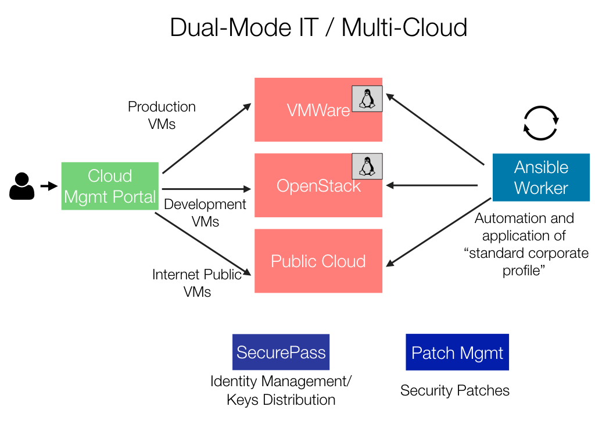

# Dual-Mode or Hybrid IT

It’s no doubt that changes in the infrastructure and -in general- in the IT won’t be made overnight. Most of my clients ask me to drive a long-term change strategy. Dual-Mode IT, hybrid-cloud or even multi-cloud are the different "facets" in which IT is evolving, but the key mesasge is that is important to run both traditional and new “cloudish” IT in the initial phase of the adoption.

Typically what I do with my team is to start changing the test and development infrastructure, because it’s non-critical and helps bringing more confidence while adopting new and agile technologies.

How the two worlds can interact really depends from customer to customer.
The usual two ways is either run "parallel worlds" by using an external Cloud Management Portal (or CMP) or by using OpenStack itself as an orchestrator.

We need to take into consideration also the existing infrastructure and we need to understand if we want to break with the existing world or just go with a parallel coexistance.

## Cloud Management Portal as orchestrator

This is probably the safest approach to "Dual-Mode IT". By using a Cloud Management Portal (CMP), you will not touch the existing infrastructre that runs on VMWare.

While it is not my personal choice, a CMP you will not only be able to integrate vmware and OpenStack, but also be able to use other virtualization and cloud solutions, such as Amazon AWS and Microsoft Azure. This will allow complete decouple technologies, even VMWare.

However, depending on the vendor of the CMP, you might be locked-in a specific vendor. Unless you decide to embrace an open-source version, but in any case it will be less "open" than the APIs provided by OpenStack.

The truth is that VMWare is still an important platform and certified for certain workloads that are not "cloudish". Most of these workloads are just the virtual representation of the bare metal ones. We are talking about monolithic architectures, such as Oracle, Microsoft Exchange and -to some extents- SAP (although is changing). Today, each instance of this type of application is still encapsulated in a single virtual machine and grows by scaling up on a single physical server running the ESXi hypervisor. Wile these solutions work well, they also require certain architectural choices be made, such as reliance on shared storage that makes scaling out difficult.

In the case of a CMP, it is possible to have two different and separated clusters that run unmodified, an OpenStack for the new cloud and dynamic applications, and an existing VMWare for the traditional monolithic workloads.

Let me give you a more complicated example of a client of mine in the oil&gas industry. To get things a little more complcated, Microsoft given the option to use Azure services as part of their global agreement and therefore was key to be integrated.

We introduced a cloud management portal and automation tools to orchestrate an internal production area on VMWare where the traditional workloads sit (typically Oracle and SAP ), an internal OpenStack area with development &testing and limited internal web applications, and an Azure area with public sites in need of bandwidth.

With these kind of scenarios, the use of internal or external doesn’t change the way IT operates. Moreover, if planned on the proper way a multi-datacenter OpenStack can allow the customer to have an automated disaster recovery system, if not even active-active business continuity with very low costs.

It’s no doubt that service providers and outsourcers were the first who understood that the adoption of open standards and agile "DevOps" methodologies bring many benefits, but also enterprises from small to large will be able to benefit as well.

Example of Cloud Management Platforms:

* [HP Cloud Service Automation (CSA)](http://www8.hp.com/us/en/software-solutions/cloud-service-automation/)
* [ManageIQ](http://manageiq.org/) or the commercial version of [RedHat CloudForms](https://www.redhat.com/en/technologies/cloud-computing/cloudforms)
* [Scalr](http://www.scalr.com/)

## OpenStack as orchestrator

In this scenario, OpenStack is used as the control plane to manage a multi-hypervisor cloud, running both vSphere and alternate hypervisors such as KVM or Xen. This approach provides common, self-service provisioning and API access. It consolidates cloud management while allowing applications to be hosted on the environment best suited for them. 

To be honest, this is my favourite way of integrating VMWare, because OpenStack acts like a single point of APIs for all workloads. The drawbacks is that it only applies to VMWare and it is preferable to run a separate VMWare cluster rather of the one you already deployed. Yet, a VMWare workload will be certified.

With OpenStack Horizon, the user is provided with a consistent experience  while offering IT the flexibility to efficiently manage the overall infrastructure and resource utilization. OpenStack supports VMWare integration through vCenter and does not support standalone ESXi hypervisors, like in the following drawing:

Talking about a well-known success story, Intel IT’s hosting organization runs a large enterprise private cloud supporting mostly traditional enterprise workloads such as ERP, a mix of custom in-house developed applications, and commercial off-the-shelf (COTS) applications. 

In 2010, they implemented a custom private cloud - a VMware-based virtualization of the data center server environment with self-service capabilities - built from existing available components. Hosting operated a separate OpenStack cloud servicing a greenfield implementation of KVM and Ceph for provisioning both internal and externally-facing workloads.

The second and current instantiation of their private cloud is built upon OpenStack as the datacenter control plane to provide an abstraction layer to the legacy cloud infrastructure. This allows Intel to end-of-life the custom automation built for the initial private cloud.

IT professionals at a large multinational banking and financial company virtualized 70-80 percent of its servers with VMware and built a tremendous amount of expertise. They wanted the self-service capabilities of the cloud to provision ESXi virtual machines using VMware HA and vMotion without re-working existing monitoring and disaster recovery.
They decided on an OpenStack management cluster to leverage the existing infrastructure and expertise. They selected one of the commercial distributions supporting ESXi.

The way I usually integrate the two "worlds" is by providing two OpenStack regions, one based on vSphere and the other based on KVM. OpenStack CLI and REST API will control VMware compute, storage and networking resources for simplified, more agile cloud automation while retaining use of VMware tools like vMotion. 

[region ]

** Note ** Limitations.

By adopting VMware vSphere and ESXi, you will have in some limitations in using OpenStack. Namely, you can't run a storage different from what is supported by VMware, i.e. you can't use Swift for example. Same thing on the network side. The only supported SDN is through NSX and without it you will be able to use only flat VLANs or flat DHCP. Glance cannot be shared between environments and is limited to the VMWare datastore.

The upstream OpenStack distribution supports VMWare out of the box by integrating with VMWare vsphere management server. If you want to have a commercial support, the following OpenStack distributions support the VMware ESXi hypervisor in a cloud environment:

* HP Helion OpenStack
* Mirantis OpenStack Private Cloud Software
* Red Hat Enterprise Linux OpenStack Platform (RHOS)
* SUSE OpenStack Cloud
* Ubuntu OpenStack
* VMware Integrated OpenStack

The VMware Integrated OpenStack (VIO) is a very specific distributiont from VMware that combines OpenStack and vSphere (ESXi) for compute, NSX for networking, VSAN for storage components in a single stack. VIO is another option for enterprises to run an OpenStack deployment on top of their existing VMware infrastructure. This is a great way to have OpenStack up&running in basically no time, however no other virtualization, storage and network technologies can be integrated.

