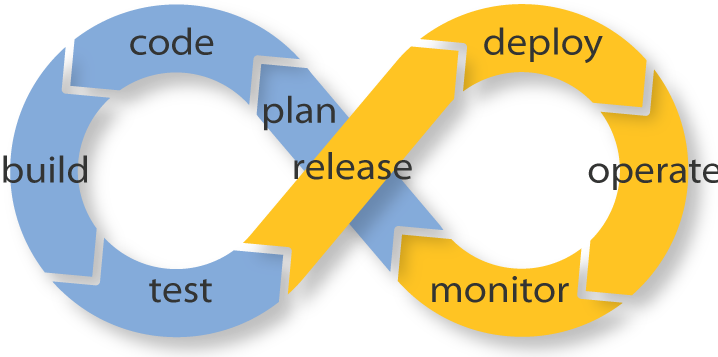

# DevOps: to the infinity and beyond

So you understood OpenStack, its components and how applications play an important role in the cloud. Before revealing to you how to be successful with OpenStack, there is another important piece I want you to understand.

The next marketing buzzword that everybody mentions nowadays is DevOps. As you might understand, DevOps is an acronym that stands for “Development” and “Operations”.

**The goal of DevOps is to improve service delivery agility**, promoting communication, collaboration and integration between software developers and IT operations. Rather than seeing these two groups as silos who pass things along but do not really work together, **DevOps recognizes the interdependence of software development and IT operations**.

In an ideal world, through the use of continuous integration tools and automated tests, a group of developers could bring a new application on-line without any operations team. For example, Flickr developed a DevOps approach to support a business requirement of ten deployments per day. Just for your own information, this kind of approach is also referred as continuous deployment or continuous delivery.

Discussing development and agile methodologies is not within the scope of this publication, but this is one thing you have to understand and keep in mind, no matter if you are an IT manager, developer or system administrator.

If you decided to embrace the cloud in full and you are thinking of adapting your application to take advantage of it, then **every single aspect of IT have to be carefully analyzed**. Development, whether you do it internally or outsourced, must be taken into consideration. Also the way your company has been organized has to change: did I mention before **Cloud is a huge shift**?
