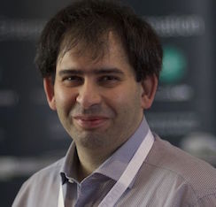

# OpenStack Explained: An Introduction to OpenStack Cloud

This e-book aims to explain OpenStack to CIOs and the newcomers to OpenStack.

My aim is to sell the e-book once a year for humanitarian reasons, such as giving the entire revenues to a non profit organization. For this reason PLEASE do not sell the e-book on your own and help me with the project.

This work is regulated under a very special (LICENSE). In summary: contributions are welcomed, no derivative work (in whatsoever mean), no responsibility from author or contributors.

* **1st edition** [provided relief to Nepal](https://life-changer.helvetas.ch/openstack) after the earthquake of 2015 through [Swiss NGO Helvetas](https://www.helvetas.org/)

## Table of Contents

* [Cloud: the undiscovered country](1_cloud_undiscovered.md)
* [Introduction to OpenStack](2_introduction_openstack.md)
* [OpenStack components](3_openstack_components.md)
* [OpenStack Regions and Availability Zones](3_openstack_regions.md)
* [The choice in OpenStack](4_openstack_choice.md)
* [Dual-Mode or Hybrid IT](5_dualmode_hybrid.md)
* [Applications in the cloud](6_cloud_applications.md)
* [DevOps: to the infinity and beyond](7_devops.md)
* [The "secret ingredient" of a successful project](8_secret_ingredient.md)

## Testimonials

> "Giuseppe is paving the way for enterprises to embrace OpenStack. Telecom Italia is, nonetheless, among these enterprises. Should you be willing to embrace the cloud, I would strongly recommend this book. I am very pleased Giuseppe is going to offer his OpenStack expertise to raise money for the disadvantaged children in Africa." - **Gianluca Pancaccini, CIO of Telecom Italia**

> "Giuseppe has done a great job of creating an important source of information on OpenStack technology while also raising money for disadvantaged children. I would encourage anyone involved in the IT industry to download this ebook and in so doing support this great initiative." - **Jeff Cotten, Managing Director, Rackspace International**

> "The OpenStack Project is one of the great examples for the dynamic of open source solutions and makes cloud technology available to organizations regardless of their size and location. Being one of the major contributors for the project, we at SUSE appreciate Giuseppe Paternó clear and concise explanation of OpenStack and it’s architecture. For those looking for an introduction to OpenStack, this will be a valuable resource. We also highly appreciate Giuseppe’s charitable support to provide clean drinking water for Children in Africa." - **Ralf Flaxa, Vice President of Engineering, SUSE**

## About the author

 Giuseppe Paterno' is an OpenStack consultant, [rated #12](https://www.bigpulse.com/pollresults?code=53195PyvG2QCq6xUmN7DTzjL) in the OpenStack community in 2015.

Giuseppe mostly act as a trusted advisor of CIO and he's also CEO/owner of two companies: [GARL](http://www.garl.ch) (Switzerland/UK) and [Alchemy Solutions](http://alchemy.solutions) (UK). He’s considered by HP and Forrester Research among the most important IT consultants in OpenStack and the cloud.

Through his extensive 20+ years experience in IT, he helps customers to embrace cloud easily, securely and risk-free. Most European telecommunications, government and finance organizations are amongst his customers. Giuseppe has a strong background in the Open Source world, where he played an important role for Canonical (the company behind Ubuntu), RedHat, Sun Microsystems, and IBM.

He also has an extensive knowledge in information security: this is reason behind his role as Visiting Professor and Researcher at the University of Trinity College Dublin in 2009.

* Web Site: (http://www.gpaterno.com)
* Twitter: [@gpaterno](https://twitter.com/gpaterno)
* Facebook Page: (https://www.facebook.com/gpaterno.pro)
* E-mail: gpaterno@gpaterno.com

## Contributors

* Guido Bolognesi
* Sab Knight
* Francesco Vollero
* Nicolas Barcet